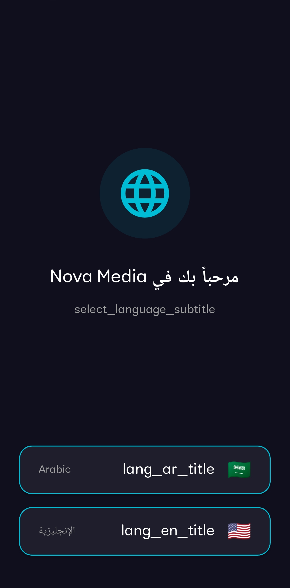
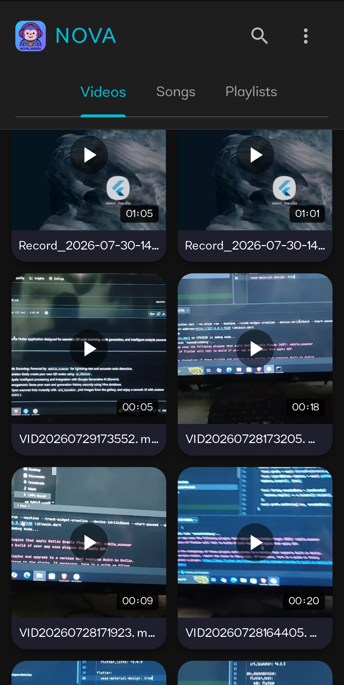
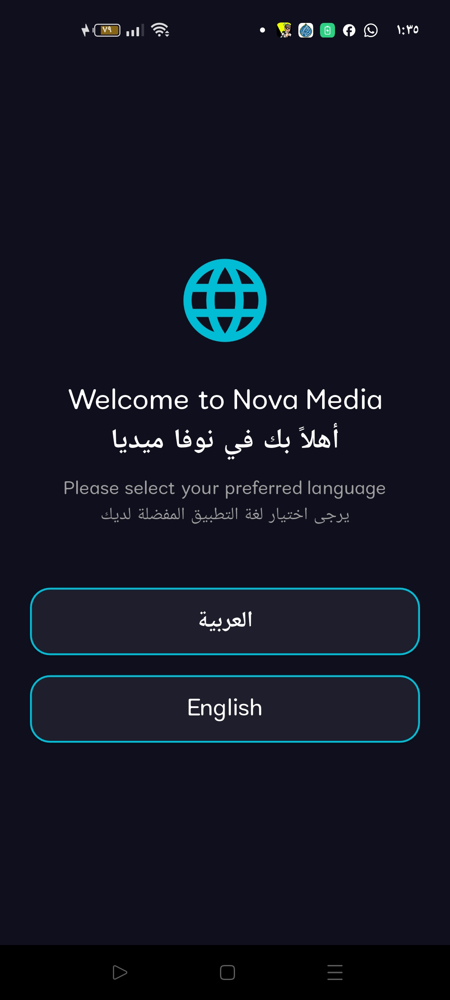
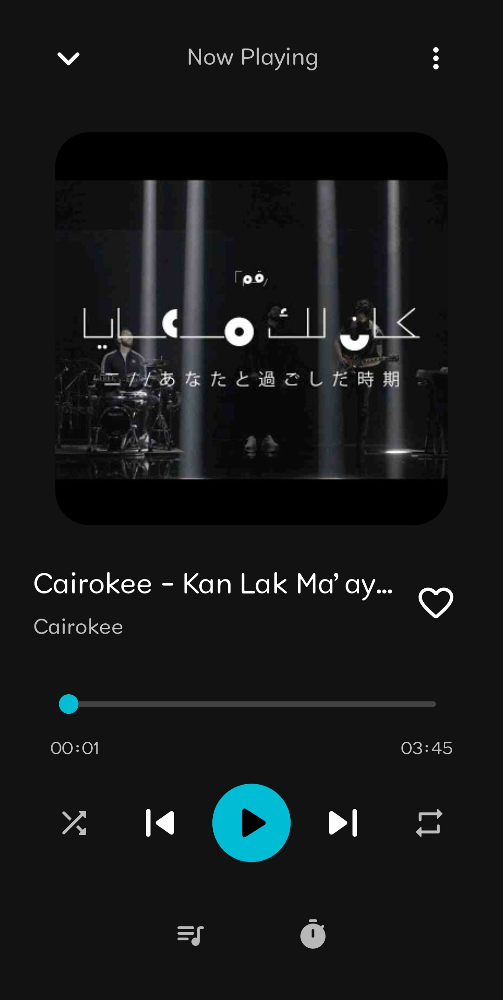
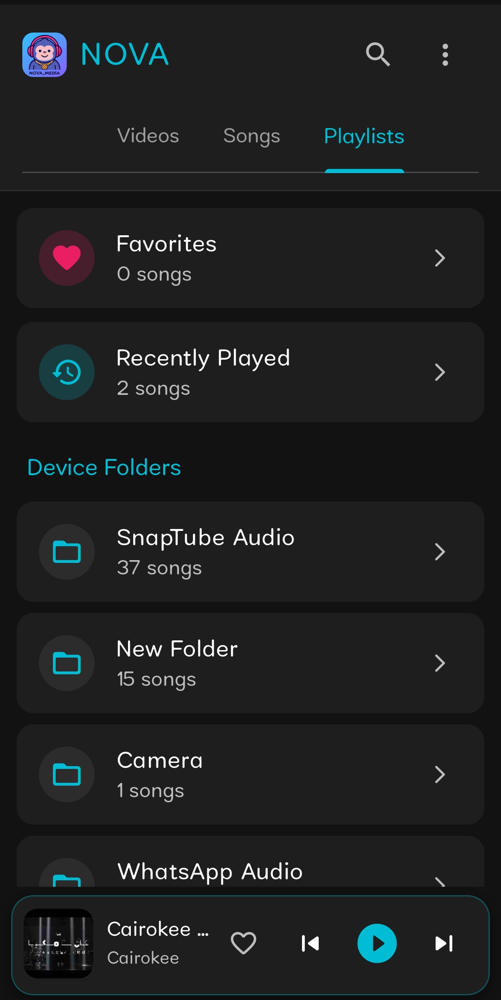
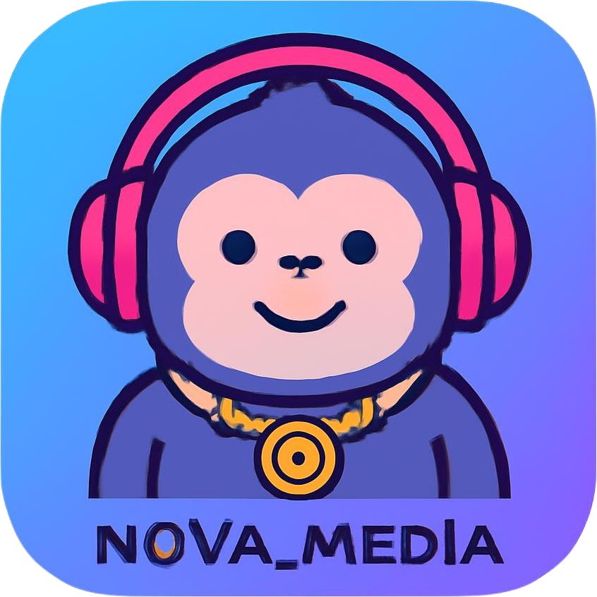

# NOVA Media

NOVA Media is a lightweight, feature-rich, and high-performance multimedia player application built with Flutter. It seamlessly integrates both audio (MP3) and video (MP4) playback into a sleek, dark-themed user interface.

## 🚀 Key Features

* **Dual-Format Playback**: Effortlessly play both MP3 audio files and MP4 video files.
* **Compact Footprint**: Optimized performance with an APK size of only **20 MB**.
* **Smart Organization**: Automatically manages your music library, folders, and playlists.
* **User Experience**: Includes features like:
   *   **Recently Played**: Keeps track of your latest listening history.
   *   **Favorites**: Manage your favorite songs with ease.
   *   **Sleep Timer**: Set a timer to automatically pause your music.
   *   **Dark Mode**: Optimized for comfortable viewing in low-light environments.
* **Modern UI**: Clean, responsive, and intuitive interface design.

## 📱 App Screenshots

  
  
  
  
  
  

---

## 📥 Download & Test

You can download the ready-to-use APK and test the app directly on your Android device:
* **[📥 Download Nova Media v1.0 (APK)](https://www.mediafire.com/file/md2xpxbeb6zp0oe/NOVA_MEDIA.apk/file)**

---
## 👨‍💻 Developed By

**Yahia Emad Samir**
*   **GitHub**: [yahyaemad887-alt](https://github.com/yahyaemad887-alt)
*   **Contact**: [+201553427179](tel:+201553427179)

---
*NOVA Media is designed for speed, simplicity, and a high-quality multimedia experience.*
